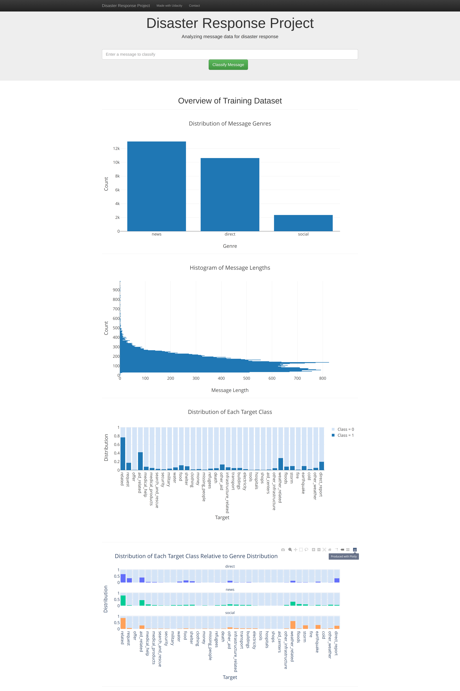
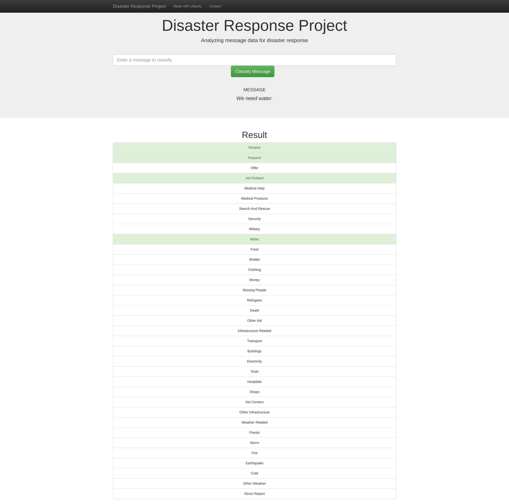

# Disaster Response Pipeline Project

# Table of Contents
1. [Motivation](#motivation)
2. [Some Cool Screenshots of the App](#screenshots)
3. [Installation](#installation)
4. [Data](#data)
5. [Usage](#usage)
6. [Licensing, Authors, Acknowledgements](#licensing)


## 1. Motivation <a name="motivation"></a>
The repository contains Machine Learning solutions for `classifying disaster response messages`. It uses text data
provided by [Appen](https://appen.com/platform-5/#data_types). Thanks to their contribution, we had public
data on which to train and test our NLP models.
The project contains three main components:
* `ETL pipeline`: it extracts data from multiple Appen data sources, transforms the data, and merges it into a suitable format.
* `Modeling pipeline`: it creates features based on the ETL data and trains and evaluates different models.
* `Web app`: it allows users to interact with the model and see the results.

## 2. Some Cool Screenshots of the App <a name="screenshots"></a>
### Data Analysis

### Model In Action


## 3. Installation <a name="installation"></a>
The code was run with:
* Ubuntu 20.4
* Python 3.7

Create & activate a conda environment with:
```shell
conda create --name disaster-response-classification python=3.7
conda activate disaster-response-classification
```
Install all the requirements:
```shell
pip install --upgrade pip
pip install -r requirements.txt
```
Install `Apache Airflow` (Optional):
```shell
# Airflow needs a home. `~/airflow` is the default, but you can put it
# somewhere else if you prefer (optional)
export AIRFLOW_HOME=~/airflow

# Install Airflow using the constraints file
AIRFLOW_VERSION=2.3.3
PYTHON_VERSION="$(python --version | cut -d " " -f 2 | cut -d "." -f 1-2)"
# For example: 3.7
CONSTRAINT_URL="https://raw.githubusercontent.com/apache/airflow/constraints-${AIRFLOW_VERSION}/constraints-${PYTHON_VERSION}.txt"
# For example: https://raw.githubusercontent.com/apache/airflow/constraints-2.3.3/constraints-3.7.txt
pip install "apache-airflow==${AIRFLOW_VERSION}" --constraint "${CONSTRAINT_URL}"

# The Standalone command will initialise the database, make a user,
# and start all components for you.
#airflow standalone

# Visit localhost:8080 in the browser and use the admin account details
# shown on the terminal to login.
# Enable the example_bash_operator dag in the home page
```
**NOTE:** Steps taken from the [Airflow official documentation](https://airflow.apache.org/docs/apache-airflow/stable/start/local.html).

## 4. Data <a name="data"></a>
We used the `diaster response messages` dataset provided by [Appen](https://appen.com/platform-5/#data_types). It contains
two data sources: `messages` and `categories`. Because the data sources are pretty small, to simplify the process, we
left the raw files in the repository at `data/`.

All the supported categories are the following:
* related
* request
* offer
* aid_related
* medical_help
* medical_products
* search_and_rescue
* security
* military
* water
* food
* shelter
* clothing
* money
* missing_people
* refugees
* death
* other_aid
* infrastructure_related
* transport
* buildings
* electricity
* tools
* hospitals
* shops
* aid_centers
* other_infrastructure
* weather_related
* floods
* storm
* fire
* earthquake
* cold
* other_weather
* direct_report

## 5. Usage <a name="usage"></a>
### File Description
```
 disaster_response_pipeline
          |-- app
                |-- templates
                        |-- go.html
                        |-- master.html
                |-- plots.py
                |-- run.py
          |-- data
                |-- disaster_message.csv
                |-- disaster_categories.csv
                |-- data.db (outcome of the ETL pipeline)
                |-- process_data.py
          |-- models
                |-- classifier.pkl (outcome of the modeling pipeline)
                |-- train_classifier.py
          |-- notebooks
                |-- ETL Pipeline Preparation.ipynb
                |-- ML Pipeline Preparation.ipynb
          |-- images
                |-- data_analysis.png
                |-- model_in_action.png
          |-- README
```

### Instructions
#### Step 1 (Optional)
Start Airflow locally with `docker-compose`:
```shell
cd airflow-docker
echo -e "AIRFLOW_UID=$(id -u)\nAIRFLOW_GID=0" > .env
docker-compose up airflow-init
docker-compose up
```
**NOTE:** You need `docker` and `docker-compose` installed on your machine.

#### Step 1
From the root directory run the ETL pipeline:
```shell
python data/process_data.py -messages-filepath data/disaster_messages.csv -categories-filepath data/disaster_categories.csv -database-filepath data/data.db
```
#### Step 2
From the root directory train the model:
```shell
python models/train_classifier.py -database-filepath data/data.db -model-filepath models/classifier.pkl -config-filepath models/config.yaml
```
Hyperparameter tuning with GridSearchCV:
```shell
python models/train_classifier.py -database-filepath data/data.db -model-filepath models/classifier.pkl -config-filepath models/config_gridsearch.yaml -gridsearch True
```
#### Step 3
From the root directory run the web app:
```shell
python -m app.run
```
To access the web app, open a browser and navigate to `http://localhost:3001/`

## 6. Licensing, Authors, Acknowledgements <a name="licensing"></a>
The code is licensed under the MIT license. I encourage anybody to use and share the code as long as you give credit to the original author.
I want to thank [Appen](https://appen.com/platform-5/#data_types) for their contribution to making the data available. Without their assistance, I would not have been able to train the model.

If anybody has machine learning questions, suggestions, or wants to collaborate with me, feel free to contact me at `p.b.iusztin@gmail.com` or on my [LinkedIn Page](https://www.linkedin.com/in/paul-iusztin-7a047814a/).
